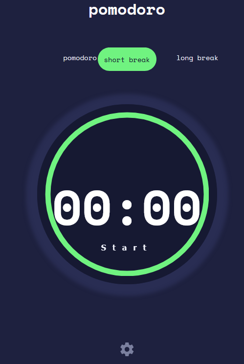

# Frontend Mentor - Pomodoro app

This is another challenge from [Frontend Mentor](https://www.frontendmentor.io). The output is as close as possible to the
design. 
The ring was created through an inspiration from [Css Tricks](https://css-tricks.com/building-progress-ring-quickly/)
Used input type number with minimun and maximum values to have auto buttons to increase and decrease the values,
this did not work on mobile as the increamental buttons did not show up. Disabled the buttons and used custom buttoms 
to control.

## View page
To view the website , use the link below
- https://chamumutezva.github.io/pomodoro-app/
- altenatively the site can be opening the html page with your favorite browser
- you can also install the app directly on your machine using the pop-up button that appears on the url bar. This ia a progresive app that is installable

## Using the app
There are 3 modes timers that you can choose from, pomodoro , short break and long mode.
Use the  **Start** button to get the timer going, the default is the pomodoro timer.
At the bottom of the page, is a settings menu button that opens the settings page.
In the settings page , the following can be changed:
- The **pomodoro timer** can be incremented up to 90 minutes 
- The **long break** can reach a maximum of 20 minutes 
- The **short break** a maximum of 10 minutes
- There are 3 types of fonts to choose from
- and 3 colors to choose from for the ring circumference
 
 

